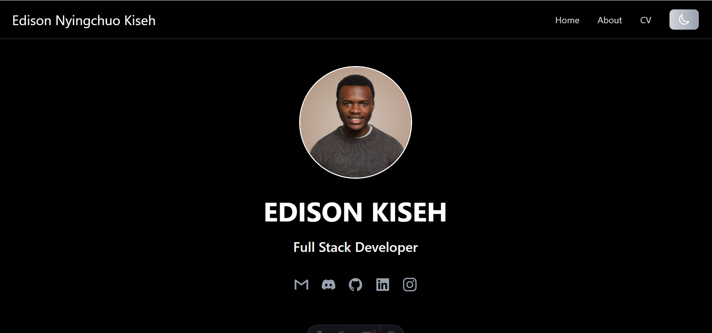

# Personal Portfolio Website
Link: https://eddsn.netlify.app/

This is my personal portfolio website, built to showcase my work as a Full Stack Developer. It highlights my projects, technical skills, experience, and CV in a clean, performant, and responsive way.

The site itself is treated as a production-ready project, focusing on good UI/UX, accessibility, and modern web best practices.

---

## 

## 🚀 Features

- Responsive design – works seamlessly across desktop, tablet, and mobile
- Dark / Light mode toggle with persisted user preference
- Project showcase with real-world applications
- Detailed About section covering skills, experience, and education
- CV page optimized for both screen and print
- Fast performance with minimal JavaScript
- Modern UI using utility-first styling
- Accessible navigation, including a mobile hamburger menu

## 🛠️ Tech Stack

- **Framework:** Astro
- **Styling:** Tailwind CSS
- **Interactivity:** Alpine.js
- **Deployment:** Static hosting using **Netlify**

## 📁 Pages

- **Home** – Introduction, short bio, and featured projects
- **About** – In-depth background, skills, technologies, and experience
- **CV** – Resume-style layout with print support
